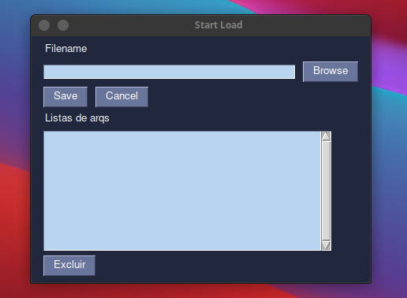
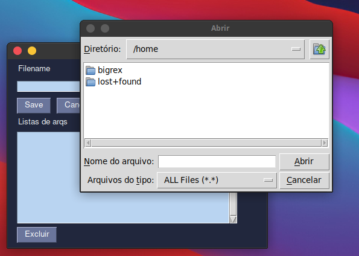

#  Start_Load_
## Descrição 
Com este simple software podemos assim que ligamos o Sistema, abrir qualque programa ou arquivo que desejamos. Somente colocarmos o caminho do programa ou arquivo e salvarmos.
## Build 
>Para efetuar a build recomendo a utilisação do pyinstaller.

## [Pyinstaller ](https://pyinstaller.readthedocs.io/en/v4.0/installation.html)
### intalação do pyinstaller 
>```pip install pyinstaller```
### built 
>```pyinstaller --onefile --windowed app.py ```
--onefile e necessario para gerar somente um arquivo.

# Windows
Para funcionar perfeitamente no windows deve criar um atalho do **open_.pyw**, 
pressionando as teclas "Windows + R" no seu teclado, No campo "Abrir", insira:
>%AppData%\Microsoft\Windows\Start Menu\Programs\Startup 

Mova o arquivo para **open_.pyw**, para esta pasta.

# Adicionar arquivos/programa para abrir ao iniciar


>Click em Browse e abrirá a seguinte tela:



>Selecione onde o arquivo/programa está, depois click em salvar. Pronto, assim que reiniciar o sistema quando iniciar vai abrir o arquivo/programa que você selecionou.
